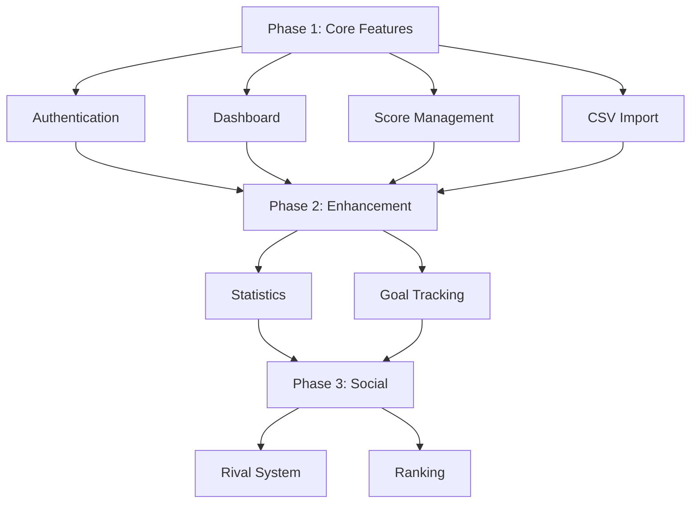

# IIDX ScoreBoard - Frontend Specification

> React 기반 웹 애플리케이션 UI/UX 명세서

[](https://react.dev/)
[](https://vitejs.dev/)
[](https://tailwindcss.com/)

---

## 📋 목차

1. [프로젝트 개요](#프로젝트-개요)
2. [기술 스택](#기술-스택)
3. [라우팅 구조](#라우팅-구조)
4. [페이지 명세](#페이지-명세)
5. [컴포넌트 아키텍처](#컴포넌트-아키텍처)
6. [상태 관리](#상태-관리)
7. [API 통합](#api-통합)
8. [UI/UX 디자인 가이드](#uiux-디자인-가이드)
9. [성능 최적화](#성능-최적화)
10. [보안 고려사항](#보안-고려사항)

---

## 프로젝트 개요

### 목적

beatmania IIDX 플레이 기록을 **시각적으로 관리**하고, **성장 추이를 추적**하며, **목표를 설정**할 수 있는 **사용자 친화적인 웹 애플리케이션** 제공.

### 핵심 가치

- 🎯 **직관성**: 게임 데이터를 누구나 이해할 수 있는 차트와 표로 표현
- ⚡ **속도**: 빠른 데이터 로딩과 부드러운 UI 전환
- 📱 **반응형**: 데스크톱/태블릿/모바일 모두 지원
- 🎨 **게임 테마**: IIDX의 사이버펑크/네온 감성 반영

---

## 기술 스택

### Core

| 기술             | 버전   | 용도                         |
| ---------------- | ------ | ---------------------------- |
| **React**        | 19.2.0 | UI 라이브러리                |
| **Vite**         | 7.2.4  | 빌드 도구 (HMR, 빠른 개발)   |
| **React Router** | 7.11.0 | 클라이언트 사이드 라우팅     |
| **Tailwind CSS** | v4     | 유틸리티 우선 CSS 프레임워크 |
| **Axios**        | 1.13.2 | HTTP 클라이언트 (CSRF 지원)  |

### 추가 필요 라이브러리

```json
{
  "dependencies": {
    "react-icons": "^5.0.0", // 아이콘
    "recharts": "^2.12.0", // 차트
    "react-table": "^8.0.0", // 테이블
    "react-dropzone": "^14.2.0", // 파일 업로드
    "zustand": "^4.5.0", // 상태 관리
    "react-hot-toast": "^2.4.0", // 토스트 알림
    "clsx": "^2.1.0", // 조건부 클래스명
    "date-fns": "^3.3.0" // 날짜 포매팅
  }
}
```

---

## 라우팅 구조

```
/                           # 홈(대시보드)
├── /login                  # 로그인
├── /signup                 # 회원가입
├── /dashboard              # 대시보드 (리디렉트: /)
├── /scores                 # 스코어 목록
│   ├── ?playStyle=SP       # 쿼리: SP/DP 필터
│   ├── ?level=12           # 쿼리: 레벨 필터
│   └── ?chartType=ANOTHER  # 쿼리: 난이도 필터
├── /tier-table             # 서열표 (난이도별 곡 순위)
│   ├── /tier-table/10      # 레벨 10 서열표
│   ├── /tier-table/11      # 레벨 11 서열표
│   └── /tier-table/12      # 레벨 12 서열표
├── /import                 # 데이터 가져오기
│   ├── /import/csv         # CSV 업로드
│   └── /import/crawler     # 크롤러 설정
├── /profile                # 프로필
│   ├── /profile/settings   # 설정
│   └── /profile/avatar     # 아바타 관리
├── /admin                  # 관리자 (ADMIN 권한 필요)
│   └── /admin/tier-table   # 서열표 관리
└── /stats                  # 통계 (향후 구현)
```

### 라우트 보호

```javascript
// Protected Route 예시
<Route element={<ProtectedRoute />}>
  <Route path="/dashboard" element={<Dashboard />} />
  <Route path="/scores" element={<Scores />} />
  <Route path="/import/*" element={<Import />} />
  <Route path="/profile/*" element={<Profile />} />
</Route>

// Public Route
<Route path="/login" element={<Login />} />
<Route path="/signup" element={<Signup />} />
```

---

## 페이지 명세

### 1. 로그인 페이지 (`/login`)

**목적**: 사용자 인증

**레이아웃**:

```
┌──────────────────────────────────┐
│   [IIDX Logo]                    │
│                                  │
│   ┌──────────────────────┐      │
│   │  Username            │      │
│   ├──────────────────────┤      │
│   │  Password            │      │
│   ├──────────────────────┤      │
│   │  [ Login ]  [Signup] │      │
│   └──────────────────────┘      │
│                                  │
│   "Don't have an account?"      │
└──────────────────────────────────┘
```

**API 연동**:

- `POST /api/auth/login`
- 성공 시 → `/dashboard` 리디렉트
- 실패 시 → 에러 메시지 표시

**상태**:

```javascript
{
  username: '',
  password: '',
  isLoading: false,
  error: null
}
```

---

### 2. 대시보드 (`/` 또는 `/dashboard`)

**목적**: 핵심 지표 한눈에 보기

**레이아웃**:

```
┌────────────────────────────────────────────────┐
│ [Header: Logo, Nav, Avatar]                   │
├────────────────────────────────────────────────┤
│                                                │
│  📊 Overview Cards                             │
│  ┌─────────┐ ┌─────────┐ ┌─────────┐         │
│  │ Total   │ │ AAA     │ │ Full    │         │
│  │ Scores  │ │ Scores  │ │ Combos  │         │
│  │  450    │ │  126    │ │   18    │         │
│  └─────────┘ └─────────┘ └─────────┘         │
│                                                │
│  📈 Recent Activity                            │
│  ┌────────────────────────────────────┐       │
│  │ [Line Chart: Last 7 Days Play]     │       │
│  └────────────────────────────────────┘       │
│                                                │
│  🎯 Recent Scores (Top 5)                      │
│  ┌────────────────────────────────────┐       │
│  │ Verflucht [A] 12 | AAA | HC | 2500 │       │
│  │ 冥 [A] 12 | AA | CLEAR | 2300       │       │
│  └────────────────────────────────────┘       │
│                                                │
│  🔄 Quick Actions                              │
│  [Upload CSV] [Start Crawler]                 │
└────────────────────────────────────────────────┘
```

**데이터 소스**:

- `GET /api/scores?page=0&size=5` (최근 스코어)
- 통계 카드는 프론트엔드에서 계산

**컴포넌트 구조**:

```
Dashboard/
├── StatsCard.jsx          // 통계 카드
├── RecentActivity.jsx     // 최근 활동 차트
├── RecentScores.jsx       // 최근 스코어 리스트
└── QuickActions.jsx       // 빠른 작업 버튼
```

---

### 3. 스코어 목록 (`/scores`)

**목적**: 전체 스코어 조회 및 필터링

**레이아웃**:

```
┌────────────────────────────────────────────────┐
│ [Header]                                       │
├────────────────────────────────────────────────┤
│ 🔍 Filters                                     │
│ [SP/DP] [Level 1-12] [Difficulty] [Clear]     │
├────────────────────────────────────────────────┤
│                                                │
│ 📊 Score Table (Sortable)                      │
│ ┌─────┬──────────┬────┬──────┬──────┬────┐   │
│ │ #   │ Song     │ L  │ Best │ Last │ PC │   │
│ ├─────┼──────────┼────┼──────┼──────┼────┤   │
│ │ 1   │ Verflucht│ 12 │ 2500 │ 2450 │ 15 │   │
│ │     │ [ANOTHER]│    │ AAA  │ AA   │    │   │
│ ├─────┼──────────┼────┼──────┼──────┼────┤   │
│ │ 2   │ 冥       │ 12 │ 2300 │ 2300 │ 8  │   │
│ │     │ [ANOTHER]│    │ AA   │ AA   │    │   │
│ └─────┴──────────┴────┴──────┴──────┴────┘   │
│                                                │
│ [← Previous] Page 1 of 10 [Next →]            │
└────────────────────────────────────────────────┘
```

**필터 옵션**:

```javascript
{
  playStyle: 'SP' | 'DP' | null,
  level: 1-12 | null,
  chartType: 'BEGINNER' | 'NORMAL' | 'HYPER' | 'ANOTHER' | 'LEGGENDARIA' | null,
  clearType: 'FULL_COMBO' | 'HARD_CLEAR' | ... | null,
  page: 0,
  size: 20
}
```

**API 연동**:

```javascript
GET /api/scores?playStyle=SP&level=12&chartType=ANOTHER&page=0&size=20
```

**테이블 기능**:

- ✅ 정렬 (곡명, 레벨, 점수, 플레이 횟수)
- ✅ 검색 (곡명)
- ✅ 페이지네이션
- ✅ 행 클릭 → 상세 모달

**상세 모달**:

```
┌────────────────────────────────┐
│ Verflucht [SP ANOTHER] Lv.12   │
├────────────────────────────────┤
│ Best Score                     │
│ ┌──────────────────────────┐   │
│ │ Score: 2500              │   │
│ │ DJ Level: AAA            │   │
│ │ Clear: HARD CLEAR        │   │
│ │ PGREAT: 1800             │   │
│ │ GREAT: 150               │   │
│ │ MISS: 5                  │   │
│ │ Played: 2026-02-10       │   │
│ └──────────────────────────┘   │
│                                │
│ Last Play                      │
│ └──────────────────────────┘   │
│ Play Count: 15                 │
│ [Close]                        │
└────────────────────────────────┘
```

---

### 4. CSV 업로드 (`/import/csv`)

**목적**: e-amusement CSV 파일 업로드

**레이아웃**:

```
┌────────────────────────────────┐
│ 📁 Upload CSV                  │
├────────────────────────────────┤
│                                │
│ 1. Select Play Style           │
│ ○ SP (Single Play)            │
│ ○ DP (Double Play)            │
│                                │
│ 2. Drag & Drop CSV File        │
│ ┌──────────────────────────┐   │
│ │                          │   │
│ │  📄 Drag CSV here        │   │
│ │  or click to browse      │   │
│ │                          │   │
│ └──────────────────────────┘   │
│                                │
│ [Upload]                       │
│                                │
│ ⚠️ Note: CSV must be UTF-8-SIG │
│    from e-amusement gate       │
└────────────────────────────────┘
```

**업로드 프로세스**:

1. 파일 선택 (react-dropzone)
2. PlayStyle 선택 (SP/DP)
3. 업로드 버튼 클릭
4. 프로그레스 바 표시
5. 결과 표시:
   ```
   ✅ Import Success
   - Songs Imported: 150
   - Charts Imported: 600
   - Scores Imported: 450
   - Scores Updated: 200
   ```

**API 연동**:

```javascript
POST /api/import/iidx/score
Content-Type: multipart/form-data
Body: { file: File, playStyle: 'SP' | 'DP' }
```

**상태**:

```javascript
{
  playStyle: 'SP' | 'DP',
  file: File | null,
  isUploading: false,
  progress: 0,
  result: ImportResponse | null,
  error: string | null
}
```

---

### 5. 크롤러 설정 (`/import/crawler`)

**목적**: e-amusement 자동 크롤링 설정

**레이아웃**:

```
┌────────────────────────────────┐
│ 🤖 Crawler Settings            │
├────────────────────────────────┤
│                                │
│ Before You Start:              │
│ 1. Login to e-amusement        │
│ 2. Open DevTools → Network     │
│ 3. Copy cookies.json           │
│                                │
│ Cookie Configuration           │
│ ┌──────────────────────────┐   │
│ │ Paste cookies.json       │   │
│ │                          │   │
│ └──────────────────────────┘   │
│                                │
│ Crawl Options                  │
│ Play Style: [SP ▼]            │
│ Level: [12 ▼]                 │
│                                │
│ [Start Crawl]                  │
│                                │
│ ⏱️ Estimated Time: 3-5 seconds │
│    (using differential crawl)  │
└────────────────────────────────┘
```

**크롤링 진행**:

```
┌────────────────────────────────┐
│ 🔄 Crawling in Progress...     │
├────────────────────────────────┤
│ [████████░░] 80%               │
│                                │
│ Step 1: List Crawl ✅          │
│ Step 2: Change Detection ✅    │
│ Step 3: Detail Crawl (5/6) ⏳  │
│                                │
│ Updated: Verflucht, 冥, ...    │
└────────────────────────────────┘
```

> **Note**: 크롤러는 Python 백엔드 서비스로 실행됩니다. 프론트엔드는 상태만 표시.

---

### 6. 프로필 (`/profile`)

**목적**: 사용자 정보 관리

**레이아웃**:

```
┌────────────────────────────────┐
│ 👤 Profile                     │
├────────────────────────────────┤
│                                │
│ Avatar                         │
│ ┌──────┐                       │
│ │ [👤] │ [Change] [Delete]     │
│ └──────┘                       │
│                                │
│ Username: exampleUser          │
│ Email: user@example.com        │
│                                │
│ Account Stats                  │
│ - Member Since: 2024-01-01     │
│ - Total Plays: 1,234           │
│ - Data Sources: CSV, Crawler   │
│                                │
│ [Edit Profile]                 │
└────────────────────────────────┘
```

**API 연동**:

- `GET /api/users/me`
- `POST /api/users/me/avatar` (파일 업로드)
- `DELETE /api/users/me/avatar`

---

### 7. 서열표 (`/tier-table/:level`)

**목적**: 레벨별 곡 난이도 서열 확인 및 클리어 현황 시각화

**개요**:

서열표는 IIDX 커뮤니티에서 사용되는 **개인차(지력) 기반 난이도 표**입니다. 같은 레벨 내에서도 곡마다 체감 난이도가 다르기 때문에, S+ (최상위) ~ F (입문) 등급으로 곡을 분류하여 사용자가 자신의 실력에 맞는 곡을 선택할 수 있도록 도와줍니다.

**지원 레벨**: 10, 11, 12

**레이아웃**:

```
┌────────────────────────────────────────────────┐
│ [Header: Logo, Nav, Avatar]                   │
├────────────────────────────────────────────────┤
│                                                │
│  📊 Level 12 Tier Table                        │
│  [Lv.10] [Lv.11] [Lv.12*]  [SP*/DP]          │
│                                                │
├────────────────────────────────────────────────┤
│ Tier │ Songs (Clear Status Colored)           │
├──────┼─────────────────────────────────────────┤
│ S+   │ ■Verflucht  ■冥  □卑弥呼  □Kagachi    │
│      │ (최상위 난이도)                         │
├──────┼─────────────────────────────────────────┤
│ S    │ □DIAVOLO  ■Despair  □ΕΛΠΙΣ           │
│      │                                         │
├──────┼─────────────────────────────────────────┤
│ A+   │ □532nm  ■Sigmund  ■AA                 │
│      │                                         │
├──────┼─────────────────────────────────────────┤
│ A    │ □Go Beyond!!  ■Thor's Hammer          │
│      │                                         │
├──────┼─────────────────────────────────────────┤
│ B+   │ □ZETA  ■Blastix Riotz                 │
│      │                                         │
├──────┼─────────────────────────────────────────┤
│ B    │ □CHRONO DIVER  ■Just a Game           │
│      │                                         │
├──────┼─────────────────────────────────────────┤
│ C    │ □Plan 8  ■Beastie Starter             │
│      │                                         │
├──────┼─────────────────────────────────────────┤
│ D    │ □Cookie Bouquets  ■Timepiece phase II │
│      │                                         │
├──────┼─────────────────────────────────────────┤
│ E    │ □Session 9  ■Cosmic Cat                │
│      │ (입문 난이도 상)                        │
├──────┼─────────────────────────────────────────┤
│ F    │ □rainbow rainbow  ■V                   │
│      │ (입문 난이도)                           │
└────────────────────────────────────────────────┘

범례:
■ = 클리어한 곡 (색상은 클리어 타입에 따름)
□ = 미클리어 곡 (회색)
```

**클리어 상태별 색상 코딩**:

| 클리어 타입       | 배경색 (Box Color)                  | 설명                     |
| ----------------- | ----------------------------------- | ------------------------ |
| **Failed**        | 회색 (`#6b7280`)                    | 미클리어 또는 실패       |
| **Assist Clear**  | 보라색 (`#a855f7`)                  | 어시스트 클리어          |
| **Easy Clear**    | 초록색 (`#22c55e`)                  | 이지 클리어              |
| **Clear**         | 파란색 (`#3b82f6`)                  | 노말 클리어              |
| **Hard Clear**    | 하얀색 (`#ffffff`) + 검은색 테두리  | 하드 클리어              |
| **EX-Hard Clear** | 노란색 (`#fbbf24`)                  | EX하드 클리어            |
| **Full Combo**    | 노란색+하얀색 그라디언트 + 반짝거림 | 풀콤보 (애니메이션 효과) |

**UI 컴포넌트**:

```jsx
// 곡 타일 예시
const SongTile = ({ songTitle, clearType }) => {
  const getColorClass = (clearType) => {
    const colors = {
      FAILED: "bg-gray-500 text-white",
      ASSIST_CLEAR: "bg-purple-500 text-white",
      EASY_CLEAR: "bg-green-500 text-white",
      CLEAR: "bg-blue-500 text-white",
      HARD_CLEAR: "bg-white text-black border-2 border-black",
      EX_HARD_CLEAR: "bg-yellow-400 text-black",
      FULL_COMBO:
        "bg-gradient-to-r from-yellow-300 via-white to-yellow-300 text-black animate-pulse",
    };
    return colors[clearType] || "bg-gray-400 text-white";
  };

  return (
    <div
      className={`inline-block px-3 py-1.5 rounded m-1 text-sm font-semibold cursor-pointer transition hover:scale-105 ${getColorClass(
        clearType,
      )}`}
      title={`${songTitle} - ${clearType}`}
    >
      {songTitle}
    </div>
  );
};
```

**데이터 소스**:

1. **서열표 데이터**: 프론트엔드에서 정적 JSON으로 관리 (커뮤니티 합의된 난이도 표)

   ```javascript
   // data/tierTable.json
   {
     "12": {
       "SP": {
         "S+": ["Verflucht", "冥", "卑弥呼", "Kagachi"],
         "S": ["DIAVOLO", "Despair", "ΕΛΠΙΣ"],
         // ...
       },
       "DP": { /* DP 서열표 */ }
     },
     "11": { /* ... */ },
     "10": { /* ... */ }
   }
   ```

2. **사용자 클리어 데이터**: `GET /api/scores?level=12&playStyle=SP` 에서 가져와서 매칭

**주요 기능**:

- ✅ 레벨 선택 (10, 11, 12)
- ✅ PlayStyle 선택 (SP/DP)
- ✅ 티어별 접기/펼치기
- ✅ 곡 클릭 시 상세 모달 (스코어 정보)
- ✅ 클리어율 표시 (예: "Tier S+: 2/4 클리어")
- ✅ 전체 진행도 바 (예: "Lv.12 SP: 78/100 클리어")

**진행도 표시**:

```
┌────────────────────────────────────────┐
│ Level 12 SP Progress                   │
│ [████████████████░░░░] 78/100 (78%)    │
│                                        │
│ Tier Breakdown:                        │
│ S+:  2/4  (50%)                        │
│ S:   5/8  (63%)                        │
│ A+: 12/15 (80%)                        │
│ A:  15/18 (83%)                        │
│ ...                                    │
└────────────────────────────────────────┘
```

**API 연동**:

```javascript
// 사용자의 해당 레벨 전체 스코어 가져오기
GET /api/scores?level=12&playStyle=SP&size=1000

// 프론트엔드에서 서열표 JSON과 매칭하여 색상 결정
const userScores = await scoresAPI.getScores({ level: 12, playStyle: 'SP', size: 1000 });
const tierData = tierTableData['12']['SP'];

// 각 곡의 클리어 타입 찾기
const enrichedTierData = Object.entries(tierData).map(([tier, songs]) => ({
  tier,
  songs: songs.map(songTitle => {
    const userScore = userScores.find(s => s.song.title === songTitle);
    return {
      title: songTitle,
      clearType: userScore?.bestClearType || 'FAILED',
    };
  }),
}));
```

**상태**:

```javascript
{
  selectedLevel: 12,
  selectedPlayStyle: 'SP',
  tierData: TierTableJson,
  userScores: ScoreResponse[],
  expandedTiers: Set<string>, // 펼쳐진 Tier 목록
}
```

---

### 8. 서열표 관리 (Admin 전용) (`/admin/tier-table`)

**목적**: 관리자가 서열표를 편집하고 업데이트

**권한**: `ROLE_ADMIN`만 접근 가능

**레이아웃**:

```
┌────────────────────────────────────────────────┐
│ [Header: Logo, Nav, Avatar] 🔐 ADMIN MODE     │
├────────────────────────────────────────────────┤
│                                                │
│  ⚙️ Tier Table Editor                          │
│  [Lv.10] [Lv.11] [Lv.12*]  [SP*/DP]          │
│                                                │
│  [Add New Song] [Save Changes] [Preview]      │
├────────────────────────────────────────────────┤
│                                                │
│ 📦 Unassigned Songs (Drag from here)          │
│ ┌──────────────────────────────────────┐      │
│ │ ● Verflucht  ● 冥  ● Kagachi         │      │
│ │ ● DIAVOLO  ● Despair                 │      │
│ └──────────────────────────────────────┘      │
│                                                │
│ Tier │ Songs (Drag to Reorder)                │
├──────┼─────────────────────────────────────────┤
│ S+ ⬍ │ [×] Verflucht  [×] 冥  [+]            │
│      │ (Drag songs here or reorder)           │
├──────┼─────────────────────────────────────────┤
│ S  ⬍ │ [×] DIAVOLO  [×] Despair  [+]         │
│      │                                         │
├──────┼─────────────────────────────────────────┤
│ A+ ⬍ │ [×] 532nm  [×] AA  [+]                │
│      │                                         │
│      ... (all tiers)                           │
└────────────────────────────────────────────────┘

[×] = Remove song from tier
[+] = Add new song to this tier
⬍ = Collapse/Expand tier
```

**주요 기능**:

#### 1. 드래그 앤 드롭

**라이브러리**: `@dnd-kit/core` (React DnD 대안, 더 현대적이고 성능 좋음)

```bash
npm install @dnd-kit/core @dnd-kit/sortable @dnd-kit/utilities
```

**기능**:

- ✅ **Unassigned → Tier**: 미배치 곡을 티어로 드래그
- ✅ **Tier → Tier**: 곡을 다른 티어로 이동
- ✅ **Within Tier**: 티어 내에서 곡 순서 변경 (어려운 곡 위로)
- ✅ **Tier → Unassigned**: 곡을 티어에서 제거

**예시 컴포넌트**:

```jsx
import {
  DndContext,
  closestCenter,
  PointerSensor,
  useSensor,
} from "@dnd-kit/core";
import {
  arrayMove,
  SortableContext,
  verticalListSortingStrategy,
} from "@dnd-kit/sortable";

const TierTableEditor = () => {
  const [tierData, setTierData] = useState(initialTierData);
  const [unassignedSongs, setUnassignedSongs] = useState([]);

  const sensors = [useSensor(PointerSensor)];

  const handleDragEnd = (event) => {
    const { active, over } = event;

    if (!over) return;

    // 곡을 티어 간 이동
    if (active.data.current.tier !== over.data.current.tier) {
      moveSongBetweenTiers(
        active.id,
        active.data.current.tier,
        over.data.current.tier,
      );
    } else {
      // 같은 티어 내에서 순서 변경
      reorderSongsInTier(active.data.current.tier, active.id, over.id);
    }
  };

  return (
    <DndContext
      sensors={sensors}
      collisionDetection={closestCenter}
      onDragEnd={handleDragEnd}
    >
      <UnassignedSongsPool songs={unassignedSongs} />

      {Object.entries(tierData).map(([tier, songs]) => (
        <TierRow key={tier} tier={tier} songs={songs} />
      ))}

      <button onClick={saveTierTable}>Save Changes</button>
    </DndContext>
  );
};
```

#### 2. 곡 추가/제거

**곡 추가 모달**:

```
┌────────────────────────────────┐
│ Add Song to Tier Table         │
├────────────────────────────────┤
│                                │
│ Search Song:                   │
│ [Verflucht____________] 🔍     │
│                                │
│ Results:                       │
│ ┌──────────────────────────┐   │
│ │ ✓ Verflucht [SP A] 12    │   │
│ │   冥 [SP A] 12            │   │
│ │   Kagachi [SP A] 12      │   │
│ └──────────────────────────┘   │
│                                │
│ [Add to Unassigned] [Cancel]   │
└────────────────────────────────┘
```

- 📊 백엔드에서 `GET /api/admin/songs?level=12&playStyle=SP` 로 곡 목록 조회
- 검색/필터로 원하는 곡 찾기
- "Add to Unassigned"로 서열표에 추가 (초기에는 Unassigned Pool에 배치)

**곡 제거**:

- 각 곡 타일의 `[×]` 버튼 클릭 → Unassigned Pool로 이동
- Unassigned Pool에서 `[×]` 클릭 → 서열표에서 완전 제거

#### 3. 저장 및 게시

**저장 프로세스**:

1. **Draft 저장** (임시 저장)

   ```javascript
   POST /api/admin/tier-table/draft
   Body: {
     level: 12,
     playStyle: 'SP',
     tiers: {
       'S+': ['Verflucht', '冥', '卑弥呼'],
       'S': ['DIAVOLO', 'Despair'],
       // ...
     },
     lastModified: '2026-02-17T17:30:00Z',
     modifiedBy: 'admin_user_id'
   }
   ```

2. **Preview** (미리보기)
   - 일반 사용자 뷰로 전환하여 변경사항 확인
   - "Edit Mode"와 "Preview Mode" 토글 버튼

3. **Publish** (게시)

   ```javascript
   POST /api/admin/tier-table/publish
   Body: { level: 12, playStyle: 'SP' }
   ```

   - Draft → Production으로 승격
   - 모든 사용자에게 적용

**변경 이력 추적**:

```
┌────────────────────────────────┐
│ 📝 Change History              │
├────────────────────────────────┤
│ 2026-02-17 17:30 by admin      │
│  • Moved Verflucht: S → S+     │
│  • Added Kagachi to tier A     │
│  • Removed ZETA from tier B+   │
│                                │
│ 2026-02-15 10:00 by admin      │
│  • Reordered tier S+           │
│  • ...                         │
└────────────────────────────────┘
```

#### 4. 권한 관리

**User 모델 확장** (백엔드):

```java
// User.java
@Entity
public class User {
    // ...

    @Enumerated(EnumType.STRING)
    private Role role = Role.USER;  // USER, ADMIN

    public enum Role {
        USER,
        ADMIN
    }
}
```

**프론트엔드 Guard**:

```jsx
// components/guards/AdminRoute.jsx
const AdminRoute = ({ children }) => {
  const { user } = useAuthStore();

  if (user?.role !== "ADMIN") {
    return <Navigate to="/" replace />;
  }

  return children;
};

// App.jsx
<Route
  path="/admin/*"
  element={
    <AdminRoute>
      <Route path="tier-table" element={<TierTableEditor />} />
    </AdminRoute>
  }
/>;
```

**백엔드 권한 체크**:

```java
@RestController
@RequestMapping("/api/admin/tier-table")
public class TierTableAdminController {

    @PostMapping("/publish")
    @PreAuthorize("hasRole('ADMIN')")
    public ResponseEntity<?> publishTierTable(
        @RequestBody TierTableDto tierTable,
        @AuthenticationPrincipal User admin
    ) {
        tierTableService.publish(tierTable, admin);
        return ResponseEntity.ok(Map.of("message", "Published successfully"));
    }
}
```

### 백엔드 API 추가 필요

#### TierTable 엔티티

```java
@Entity
public class TierTable {
    @Id
    @GeneratedValue
    private Long id;

    private Integer level;              // 10, 11, 12
    private String playStyle;           // SP, DP

    @Column(columnDefinition = "JSON")
    private String tierDataJson;        // JSON 형식으로 저장

    private Boolean isDraft;            // true=임시저장, false=게시됨

    @ManyToOne
    private User lastModifiedBy;

    private LocalDateTime lastModified;

    // Getters/Setters
}
```

#### API 엔드포인트

| Method | Endpoint                        | 설명                | 권한   |
| ------ | ------------------------------- | ------------------- | ------ |
| GET    | `/api/tier-table/:level/:style` | 서열표 조회 (일반)  | Public |
| GET    | `/api/admin/tier-table/draft`   | Draft 조회          | ADMIN  |
| POST   | `/api/admin/tier-table/draft`   | Draft 저장          | ADMIN  |
| POST   | `/api/admin/tier-table/publish` | 게시 (Draft → Prod) | ADMIN  |
| GET    | `/api/admin/songs`              | 전체 곡 목록 조회   | ADMIN  |
| GET    | `/api/admin/tier-table/history` | 변경 이력 조회      | ADMIN  |

**컴포넌트 구조 업데이트**:

```
src/
├── components/
│   ├── admin/
│   │   ├── TierTableEditor.jsx      # 메인 에디터
│   │   ├── DraggableSongTile.jsx    # 드래그 가능한 곡 타일
│   │   ├── DroppableTierRow.jsx     # 드롭 가능한 티어 행
│   │   ├── UnassignedPool.jsx       # 미배치 곡 풀
│   │   ├── AddSongModal.jsx         # 곡 추가 모달
│   │   └── ChangeHistoryPanel.jsx   # 변경 이력
│   └── guards/
│       └── AdminRoute.jsx            # Admin 권한 체크
│
├── pages/
│   └── admin/
│       └── TierTableManagement.jsx  # Admin 서열표 관리 페이지
```

---

## 컴포넌트 아키텍처

### 디렉토리 구조

```
src/
├── components/               # 재사용 가능한 컴포넌트
│   ├── common/
│   │   ├── Button.jsx        # 버튼
│   │   ├── Input.jsx         # 입력 필드
│   │   ├── Modal.jsx         # 모달
│   │   ├── Table.jsx         # 테이블
│   │   ├── Card.jsx          # 카드
│   │   └── Spinner.jsx       # 로딩 스피너
│   ├── layout/
│   │   ├── Header.jsx        # 헤더
│   │   ├── Sidebar.jsx       # 사이드바 (모바일 메뉴)
│   │   └── Footer.jsx        # 푸터
│   ├── scores/
│   │   ├── ScoreTable.jsx    # 스코어 테이블
│   │   ├── ScoreCard.jsx     # 스코어 카드
│   │   ├── ScoreFilter.jsx   # 필터
│   │   └── ScoreDetailModal.jsx
│   ├── dashboard/
│   │   ├── StatsCard.jsx
│   │   ├── RecentActivity.jsx
│   │   └── QuickActions.jsx
│   ├── import/
│   │   ├── CsvUploader.jsx
│   │   └── CrawlerConfig.jsx
│   └── tier-table/
│       ├── TierGrid.jsx          # 서열표 그리드
│       ├── SongTile.jsx           # 곡 타일 (색상 코딩)
│       ├── TierRow.jsx            # Tier별 행
│       ├── ProgressBar.jsx        # 진행도 바
│       └── TierLegend.jsx         # 범례
│
├── pages/                    # 페이지 컴포넌트
│   ├── Login.jsx
│   ├── Signup.jsx
│   ├── Dashboard.jsx
│   ├── Scores.jsx
│   ├── TierTable.jsx         # 서열표
│   ├── Import.jsx
│   └── Profile.jsx
│
├── hooks/                    # 커스텀 훅
│   ├── useAuth.js            # 인증 상태
│   ├── useScores.js          # 스코어 데이터
│   └── useToast.js           # 토스트 알림
│
├── store/                    # Zustand 스토어
│   ├── authStore.js
│   ├── scoresStore.js
│   └── uiStore.js
│
├── api/                      # API 클라이언트
│   ├── client.js             # Axios 인스턴스 (이미 존재)
│   ├── auth.js
│   ├── scores.js
│   └── import.js
│
├── utils/                    # 유틸리티
│   ├── formatters.js         # 날짜/숫자 포맷
│   ├── validators.js         # 유효성 검사
│   └── constants.js          # 상수
│
├── data/                     # 정적 데이터
│   └── tierTable.json        # 서열표 데이터 (레벨별)
│
└── styles/
    └── globals.css           # 전역 스타일
```

---

## 상태 관리

### Zustand 스토어 예시

#### Auth Store

```javascript
// store/authStore.js
import { create } from "zustand";
import { persist } from "zustand/middleware";

export const useAuthStore = create(
  persist(
    (set) => ({
      user: null,
      isAuthenticated: false,

      setUser: (user) => set({ user, isAuthenticated: true }),
      logout: () => set({ user: null, isAuthenticated: false }),
    }),
    {
      name: "auth-storage",
    },
  ),
);
```

#### Scores Store

```javascript
// store/scoresStore.js
import { create } from "zustand";

export const useScoresStore = create((set) => ({
  scores: [],
  filters: {
    playStyle: null,
    level: null,
    chartType: null,
    clearType: null,
  },
  pagination: {
    page: 0,
    size: 20,
    totalPages: 0,
  },

  setFilters: (filters) => set({ filters }),
  setScores: (scores, pagination) => set({ scores, pagination }),
  clearFilters: () =>
    set({
      filters: {
        playStyle: null,
        level: null,
        chartType: null,
        clearType: null,
      },
    }),
}));
```

---

## API 통합

### API 클라이언트 구조

```javascript
// api/auth.js
import apiClient from "./client";

export const authAPI = {
  login: (credentials) => apiClient.post("/auth/login", credentials),

  logout: () => apiClient.post("/auth/logout"),

  getCurrentUser: () => apiClient.get("/users/me"),
};

// api/scores.js
export const scoresAPI = {
  getScores: (params) => apiClient.get("/scores", { params }),
};

// api/import.js
export const importAPI = {
  uploadCSV: (formData) =>
    apiClient.post("/import/iidx/score", formData, {
      headers: { "Content-Type": "multipart/form-data" },
    }),
};
```

### 커스텀 훅 예시

```javascript
// hooks/useScores.js
import { useQuery } from "@tanstack/react-query";
import { scoresAPI } from "../api/scores";
import { useScoresStore } from "../store/scoresStore";

export const useScores = () => {
  const { filters, pagination } = useScoresStore();

  return useQuery({
    queryKey: ["scores", filters, pagination.page],
    queryFn: () =>
      scoresAPI.getScores({
        ...filters,
        page: pagination.page,
        size: pagination.size,
      }),
  });
};
```

---

## UI/UX 디자인 가이드

### 색상 팔레트 (IIDX 테마)

```css
:root {
  /* Primary (Electric Blue) */
  --color-primary-50: #e0f2fe;
  --color-primary-500: #0ea5e9;
  --color-primary-700: #0369a1;
  --color-primary-900: #0c4a6e;

  /* Accent (Neon Pink) */
  --color-accent-500: #ec4899;
  --color-accent-700: #be185d;

  /* Clear Type Colors (Updated for Tier Table) */
  --color-failed: #6b7280; /* Gray */
  --color-assist: #a855f7; /* Purple */
  --color-easy: #22c55e; /* Green */
  --color-clear: #3b82f6; /* Blue */
  --color-hard: #ffffff; /* White */
  --color-exhard: #fbbf24; /* Yellow */
  --color-fullcombo: linear-gradient(
    90deg,
    #fde047,
    #ffffff,
    #fde047
  ); /* Yellow-White gradient */

  /* DJ Level Colors */
  --color-dj-aaa: #fbbf24; /* Gold */
  --color-dj-aa: #d1d5db; /* Silver */
  --color-dj-a: #cd7f32; /* Bronze */

  /* Dark Theme */
  --color-bg-dark: #0f172a;
  --color-bg-darker: #020617;
  --color-text-light: #f1f5f9;
}
```

### 타이포그래피

```css
/* Headings */
.heading-1 {
  @apply text-4xl font-bold;
}
.heading-2 {
  @apply text-3xl font-semibold;
}
.heading-3 {
  @apply text-2xl font-semibold;
}

/* Body */
.body-large {
  @apply text-lg;
}
.body-normal {
  @apply text-base;
}
.body-small {
  @apply text-sm;
}

/* Monospace (Scores) */
.score-text {
  @apply font-mono text-2xl font-bold;
}
```

### 컴포넌트 스타일

#### 버튼

```jsx
// Primary Button
<button className="bg-primary-500 hover:bg-primary-600 text-white px-6 py-2 rounded-lg transition">
  Upload CSV
</button>

// Danger Button
<button className="bg-red-500 hover:bg-red-600 text-white px-6 py-2 rounded-lg">
  Delete
</button>
```

#### 카드

```jsx
<div className="bg-white dark:bg-gray-800 rounded-xl shadow-lg p-6">
  <h3 className="text-xl font-bold mb-4">Total Scores</h3>
  <p className="text-4xl font-mono">450</p>
</div>
```

#### Clear Type Badge

```jsx
const clearTypeBadge = (clearType) => {
  const colors = {
    FULL_COMBO: "bg-yellow-500",
    EX_HARD_CLEAR: "bg-purple-500",
    HARD_CLEAR: "bg-blue-500",
    CLEAR: "bg-green-500",
    // ...
  };

  return (
    <span
      className={`${colors[clearType]} text-white px-3 py-1 rounded-full text-sm`}
    >
      {clearType}
    </span>
  );
};
```

---

## 성능 최적화

### 1. Code Splitting

```javascript
import { lazy, Suspense } from "react";

const Dashboard = lazy(() => import("./pages/Dashboard"));
const Scores = lazy(() => import("./pages/Scores"));

<Suspense fallback={<Spinner />}>
  <Routes>
    <Route path="/" element={<Dashboard />} />
    <Route path="/scores" element={<Scores />} />
  </Routes>
</Suspense>;
```

### 2. 가상화 (대량 데이터)

```javascript
import { useVirtualizer } from "@tanstack/react-virtual";

// ScoreTable에서 1000+ 행 렌더링 시
const rowVirtualizer = useVirtualizer({
  count: scores.length,
  getScrollElement: () => parentRef.current,
  estimateSize: () => 60,
});
```

### 3. React Query 캐싱

```javascript
// 5분간 캐싱
queryClient.setQueryDefaults(["scores"], {
  staleTime: 5 * 60 * 1000,
  cacheTime: 10 * 60 * 1000,
});
```

---

## 보안 고려사항

### CSRF 보호

```javascript
// api/client.js (이미 구현됨)
apiClient.interceptors.request.use((config) => {
  const csrfToken = document.cookie
    .split("; ")
    .find((row) => row.startsWith("XSRF-TOKEN="))
    ?.split("=")[1];

  if (csrfToken) {
    config.headers["X-XSRF-TOKEN"] = csrfToken;
  }

  return config;
});
```

### XSS 방지

```javascript
// 사용자 입력 sanitize
import DOMPurify from "dompurify";

const sanitizedHTML = DOMPurify.sanitize(userInput);
```

### 민감 정보 보호

```javascript
// .env 환경 변수 사용
VITE_API_BASE_URL=http://localhost:8080/api

// 코드에서 사용
const apiUrl = import.meta.env.VITE_API_BASE_URL;
```

---

## 향후 개선 사항

### Phase 1 (현재 명세)

- ✅ 로그인/회원가입
- ✅ 대시보드
- ✅ 스코어 목록/필터
- ✅ CSV 업로드
- ✅ 프로필 관리

### Phase 2 (추가 기능)

- 📊 **통계 대시보드**: 성장 추이 차트, 난이도별 분포
- 🎯 **목표 설정**: "Lv.12 전곡 클리어" 등 목표 트래킹
- 🔔 **알림**: 신기록 달성 시 알림
- 📱 **PWA**: 오프라인 지원, 홈 화면 추가

### Phase 3 (소셜 기능)

- 👥 **라이벌 비교**: 친구와 스코어 비교
- 🏆 **랭킹**: 레벨별/곡별 랭킹
- 💬 **커뮤니티**: 팁 공유, Q&A

---

## 개발 우선순위



---

## 참고 자료

- [백엔드 API 명세](../../iidxScoreBoard/docs/api-spec.md)
- [프로젝트 개요](../../iidxScoreBoard/docs/PROJECT-OVERVIEW.md)
- [크롤링 최적화](../../iidxScoreBoard/docs/CRAWLING_OPTIMIZATION.md)
- [React 공식 문서](https://react.dev/)
- [Tailwind CSS 공식 문서](https://tailwindcss.com/)

---

**작성자**: IIDX ScoreBoard 개발팀  
**최종 수정**: 2026-02-17  
**버전**: 1.0.0
